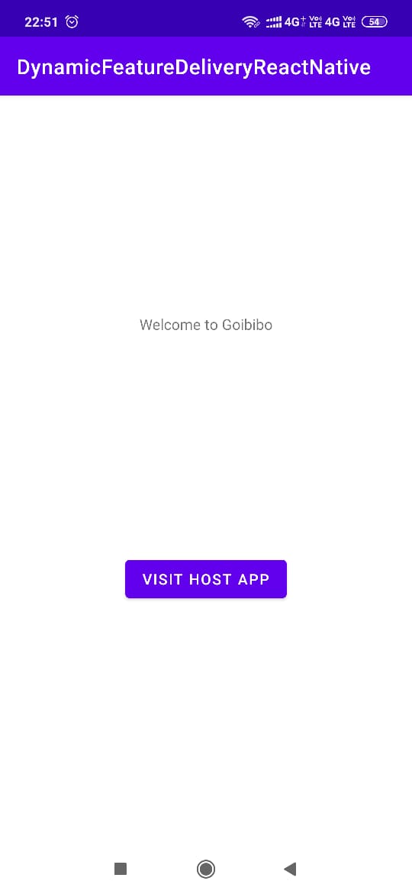
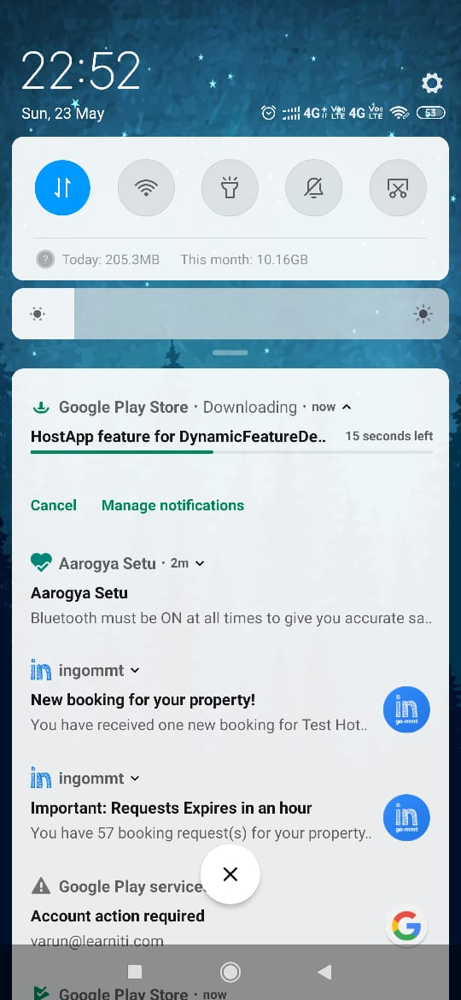
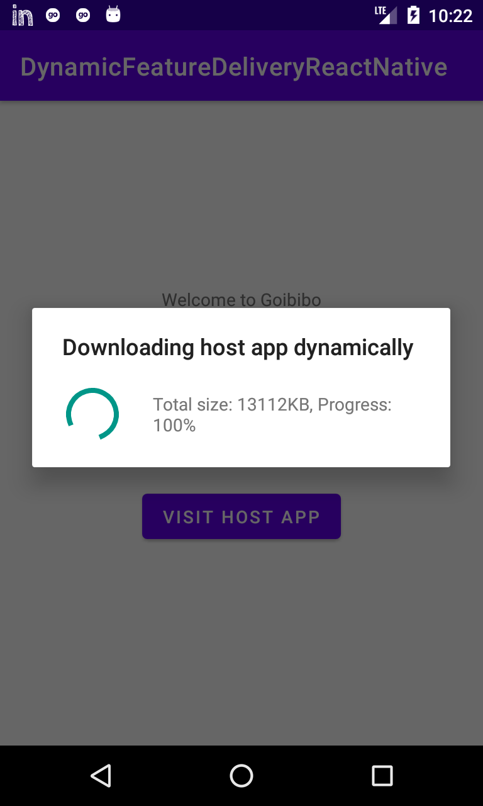
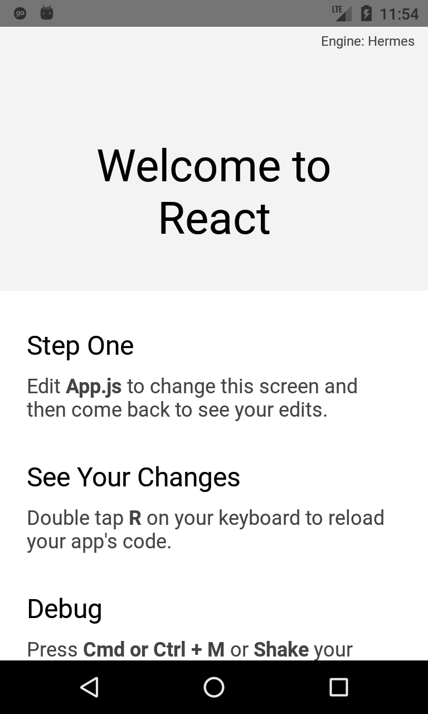

# dynamic-feature-delivery-react-native
Android POC: dynamically loading react-native app in native app using Play Feature Delivery

## Screenshots

 

 

## Folder structure

1. app: Base module
2. ingornaltacco: Dynamic module that will be installed on demand. This module is using react-native
3. INGO-RN-AltAccoJS: React native app created by react-native CLI. This is used by ingornaltacco

## Local testing of app

Docs: https://developer.android.com/guide/playcore/feature-delivery/on-demand#local-testing

#### Steps

1. Download & install bundletool https://github.com/google/bundletool/releases
2. Generate signed bundle from Android studio
3. Create apks
```
java -jar bundletool-all-1.6.1.jar build-apks --local-testing --bundle ~/Desktop/github/DynamicFeatureDeliveryReactNative/app/release/app-release.aab --output my_app.apks
```
4. Install apks
```
java -jar bundletool-all-1.6.1.jar install-apks --apks my_app.apks
```

## Production testing

Install app from PlayStore: https://play.google.com/store/apps/details?id=varunon9.me.dynamicfeature
